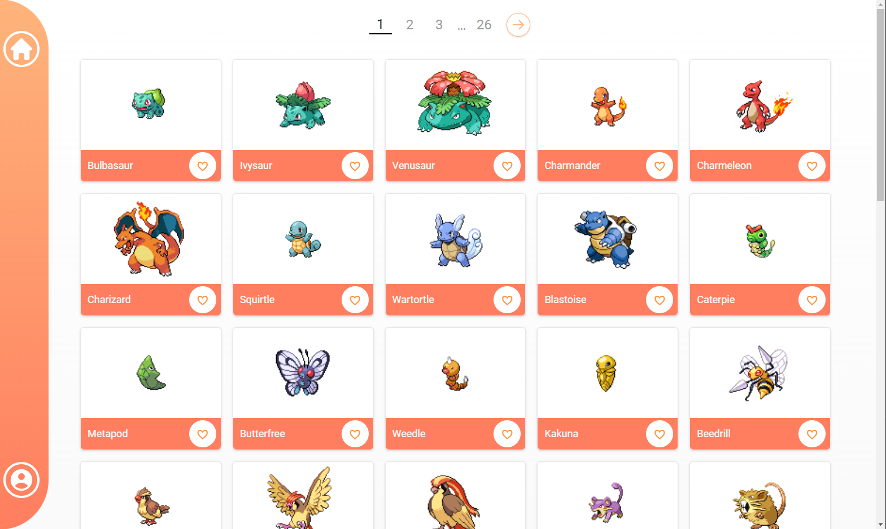
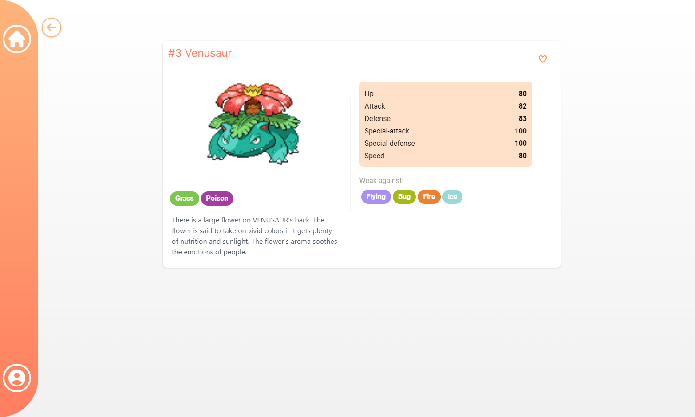

# EaPokemonTrainer

This is an application for the user to view pokemons and 'collect' them.

Pokemons are retrieved from [pokeapi](https://pokeapi.co/docs/v2), and the user data is saved to an instance of [json-server](https://github.com/typicode/json-server).

Goal of the project was to make a single-page application using Angular Framework.

## Screenshots

Login page

Catalogue page

Pokemon info page

